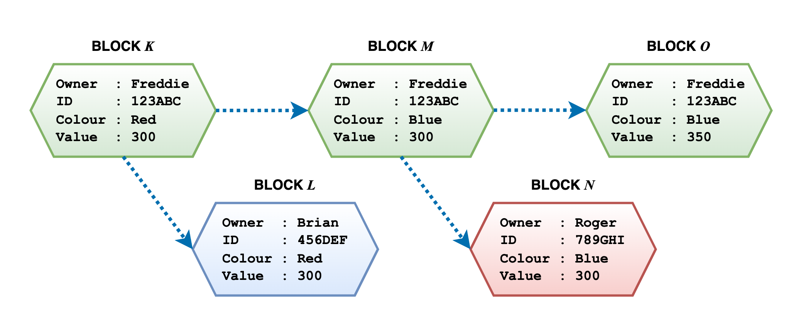

# multiple-tx

A Hyperledger Fabric's demo that attempts branching of blocks throughout transactions



## Description

* A demo source of JavaScript for multiple transactions and branchings on Blockchain.
* It enables the owners to keep their own ownerships even though they are transferred into others.
* It requires Hyperledger Fabric's library.
* Enjoy.

## Set up

As the demo is based on the Hyperledger Fabric flamework (https://hyperledger-fabric.readthedocs.io/en/latest/index.html), you may have to set up the Hyperledger Fabric into your environment at the first place:

### 1. Installing prerequisite softwares

By following the Getting Started Manual (https://hyperledger-fabric.readthedocs.io/en/latest/getting_started.html), install the required softwares such as `Docker`, `cURL` and `HOMEBREW`, if necessary.

### 2. Activate Docker and Docker compose

Make sure Docker is correctly installed. The following command is an example of launching Docker on Terminal:

``` bash
open /Applications/Docker.app
```

Or type the command below to confirm if it is already launched:

``` bash
docker --version
docker-compose -v  
```

### 3. Implementing Hyperledger to your environment

Acquire the Hyperledger Fabric Samples' installer by typing the following command with `curl`:

``` bash
curl -sSLO https://raw.githubusercontent.com/hyperledger/fabric/main/scripts/install-fabric.sh && chmod +x install-fabric.sh
```

You will get a installer `install-fabric.sh` on the current working directory. Then run the following command to clone the samples repo:

``` bash
./install-fabric.sh docker samples binary
```
If successful, you will get the directory `fabric-samples` on the current working environment.

For more detailed information, visit https://hyperledger-fabric.readthedocs.io/en/latest/install.html

### 4. Create a channel

Go to `test-network` directory and find `./network.sh` to start deploying the instance of Hyperledger Fabric Samples:

``` bash
cd fabric-samples/test-network
```

Then run this command to confirm a channel is not created yet or kill any active channels previously generated:

``` bash
./network down
```

NOTE that if you face an error in this step, a typical cause might be that Docker and Docker Compose are not started: please check they are correctly launched in your environment.

The run this command to start a test network:

``` bash
./network up createChannel -ca
```

For more detailed information, visit https://hyperledger-fabric.readthedocs.io/en/latest/deploy_chaincode.html

### 5. Deploy chaincode package

Before deploying a chaincode package, you need to set the path of connection profiles which are generated when you created a channel on the previous step: you may be able to find two JSON files in the following directories after running the command `./network.sh up createChannel -ca`:

```
[for peer organisation 1] 
fabric-samples/test-network/organizations/peerOrganizations/org1.example.com/

[for peer organisation 2]
fabric-samples/test-network/organizations/peerOrganizations/org2.example.com/
```

Go to `/multiple-tx/application/utils` and open `AppUtil.js`, and modify the variables into YOUR OWN CONNECTION PROFILES' PATHS:

```
### This is content of AppUtil.js

// !!! SET YOUR 'connection-org1.json' PATH TO HERE !!!
const ccpPath1 = '/<your path>/fabric-samples/test-network/organizations/peerOrganizations/org1.example.com/connection-org1.json';
const ccpPath2 = '/<your path>/fabric-samples/test-network/organizations/peerOrganizations/org2.example.com/connection-org2.json';
// !!! SET YOUR 'connection-org2.json' PATH TO HERE !!!
```

Then, deploy the chaincode package cointaining the smart contract with its channel name `branch-tx-demo`, by setting your own path to `multiple-tx/chaincode` directory:

``` bash
./network.sh deployCC -ccn branch-tx-demo -ccp /<your path>/multiple-tx/chaincode/ -ccl javascript
```

For more detailed information, visit https://hyperledger-fabric.readthedocs.io/en/latest/write_first_app.html

### 6. Install and run the app

Go to `multiple-tx/application` to find `app.js`, and then type `npm install` to install the app:

``` bash
cd multiple-tx/application
npm install
```

Then, run this command to run:

``` bash
node app.js
```

The demo of branching assets throughout the Blockchain will start!

