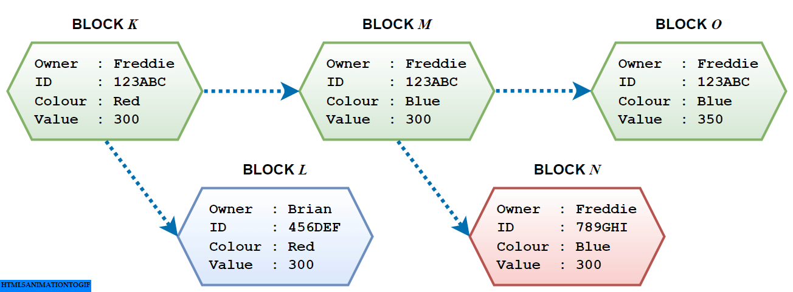

# multiple-tx

A Hyperledger Fabric's demo that attempts branching of blocks throughout transactions

## Description

* A demo source of JavaScript for multiple transactions and branchings on Blockchain.
* It enables the owners to keep their own ownerships even though they are transferred into others.
* It requires Hyperledger Fabric's library.
* Enjoy.

## Set up

As the demo is based on the Hyperledger Fabric flamework (https://hyperledger-fabric.readthedocs.io/en/latest/index.html), you may have to set up the Hyperledger Fabric into your environment at the first place:

By following the Getting Started Manual (https://hyperledger-fabric.readthedocs.io/en/latest/getting_started.html), install the required softwares such as `Docker`, `cURL` and `HOMEBREW`, if necessary.

